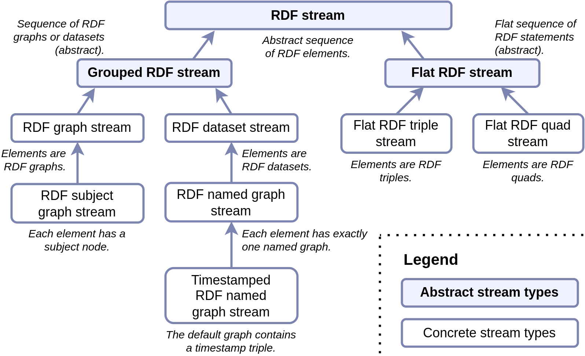

# Taxonomy overview

The diagram below is an overview of the RDF Stream Taxonomy (RDF-STaX). Each term in the diagram is represented by an instance of the `#!turtle stax:RdfStreamType` class in the [RDF-STaX ontology](ontology.md). The ontology also contains the formal definitions of each stream type.

<figure markdown>
  { width="600" }
  <figcaption>Overview of the taxonomy – click to enlarge.</figcaption>
</figure>

## Abstract stream types

Abstract stream types only serve as a basis for the concrete stream types. They are not intended to be used directly.

### RDF stream

IRI: [`https://w3id.org/stax/ontology#rdfStream`](https://w3id.org/stax/ontology#rdfStream)

An **RDF stream** is an ordered, potentially infinite sequence of RDF stream elements.

----

### Grouped RDF stream

IRI: [`https://w3id.org/stax/ontology#groupedStream`](https://w3id.org/stax/ontology#groupedStream)

A **grouped RDF stream** is an [RDF stream](#rdf-stream) whose elements are either RDF graphs or RDF datasets.

----

### Flat RDF stream

IRI: [`https://w3id.org/stax/ontology#flatStream`](https://w3id.org/stax/ontology#flatStream)

A **flat RDF stream** is an [RDF stream](#rdf-stream) whose elements are statements (either RDF triples or RDF quads).

----

## Concrete stream types (grouped)

### RDF graph stream

IRI: [`https://w3id.org/stax/ontology#graphStream`](https://w3id.org/stax/ontology#graphStream)

An **RDF graph stream** is a [grouped RDF stream](#grouped-rdf-stream) whose elements are unnamed (default) RDF graphs.

Can be flattened[^1] into a [flat RDF triple stream](#flat-rdf-triple-stream).  
Can be trivially extended[^3] into an [RDF dataset stream](#rdf-dataset-stream).

----

### RDF subject graph stream

IRI: [`https://w3id.org/stax/ontology#subjectGraphStream`](https://w3id.org/stax/ontology#subjectGraphStream)

An **RDF subject graph stream** is an [RDF graph stream](#rdf-graph-stream) in which every element contains an IRI node (called the subject node) that uniquely identifies the graph in the stream. Every other node in the graph can be reached by traversing triples, starting from the subject node.

Can be flattened[^1] into a [flat RDF triple stream](#flat-rdf-triple-stream).  
Can be trivially extended[^3] into an [RDF dataset stream](#rdf-dataset-stream).

----

### RDF dataset stream

IRI: [`https://w3id.org/stax/ontology#datasetStream`](https://w3id.org/stax/ontology#datasetStream)

An **RDF dataset stream** is a [grouped RDF stream](#grouped-rdf-stream) whose elements are RDF datasets.

Can be flattened[^1] into a [flat RDF quad stream](#flat-rdf-quad-stream).

----

### RDF named graph stream

IRI: [`https://w3id.org/stax/ontology#namedGraphStream`](https://w3id.org/stax/ontology#namedGraphStream)

An **RDF named graph stream** is an [RDF dataset stream](#rdf-dataset-stream) in which every element has exactly one named RDF graph pair $\langle n, G \rangle$, where $G$ is an RDF graph, and $n$ is the graph name. Apart from graph $G$, the dataset may contain any number of triples in the default graph.

Can be flattened[^1] into a [flat RDF quad stream](#flat-rdf-quad-stream).

----

### Timestamped RDF named graph stream

IRI: [`https://w3id.org/stax/ontology#timestampedNamedGraphStream`](https://w3id.org/stax/ontology#timestampedNamedGraphStream)

A **timestamped named graph** is an RDF dataset in which:  
(1) there is exactly one named RDF graph pair $\langle n, G \rangle$, where $G$ is an RDF graph, and $n$ is the graph name;  
(2) the default graph includes a timestamp triple $\langle n, p, t \rangle$, where $p$ is a timestamp predicate that relates $t$, called the timestamp, and the graph $G$.

A **timestamped RDF named graph stream** is an [RDF named graph stream](#rdf-named-graph-stream) in which every element is a timestamped named graph. The elements that share the same timestamp predicate $p$ are ordered by the partial order associated with $p$.

Can be flattened[^1] into a [flat RDF quad stream](#flat-rdf-quad-stream).

----

## Concrete stream types (flat)

### Flat RDF triple stream

IRI: [`https://w3id.org/stax/ontology#flatTripleStream`](https://w3id.org/stax/ontology#flatTripleStream)

A **flat RDF triple stream** is a [flat RDF stream](#flat-rdf-stream) whose elements are triples.

Can be grouped[^2] into an [RDF graph stream](#rdf-graph-stream).  
Can be trivially extended[^3] into a [flat RDF quad stream](#flat-rdf-quad-stream).

----

### Flat RDF quad stream

IRI: [`https://w3id.org/stax/ontology#flatQuadStream`](https://w3id.org/stax/ontology#flatQuadStream)

A **flat RDF quad stream** is a [flat RDF stream](#flat-rdf-stream) whose elements are quads.

Can be grouped[^2] into an [RDF dataset stream](#rdf-dataset-stream).

----

## See also

- You can find a detailed discussion on the taxonomy in the **[RDF-STaX paper](https://arxiv.org/abs/2311.14540)**.
- [Ontology documentation](ontology.md)
- [How to use RDF-STaX?](use-it.md)

## Footnotes

[^1]: The flattening is done by enumerating all components of the stream elements in one, flat stream. For example, a graph stream can be flattened into a flat triple stream.
[^2]: The grouping is done by splitting the flat stream of statements into groups, which then can be used to construct elements of the grouped stream. For example, a flat triple stream can be grouped into a graph stream. In this operation, the ordering information within a group is lost.
[^3]: You can extend a stream that uses triples or graphs into a stream type that uses quads or datasets. The extension is done by (in case of flat RDF streams) adding a fourth component, corresponding to the default graph. In case of grouped RDF streams, the contents of the graph are placed explicitly in the default graph.
